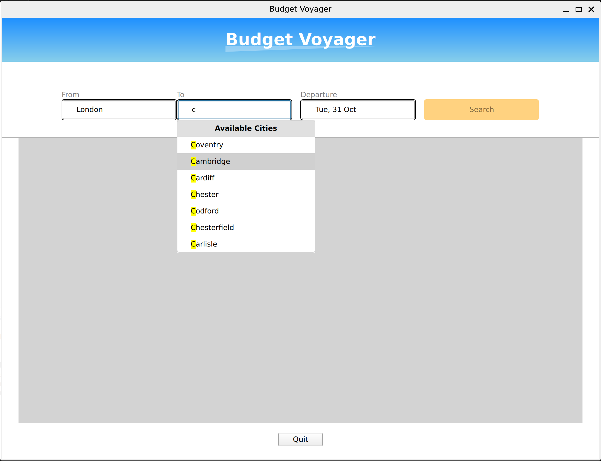
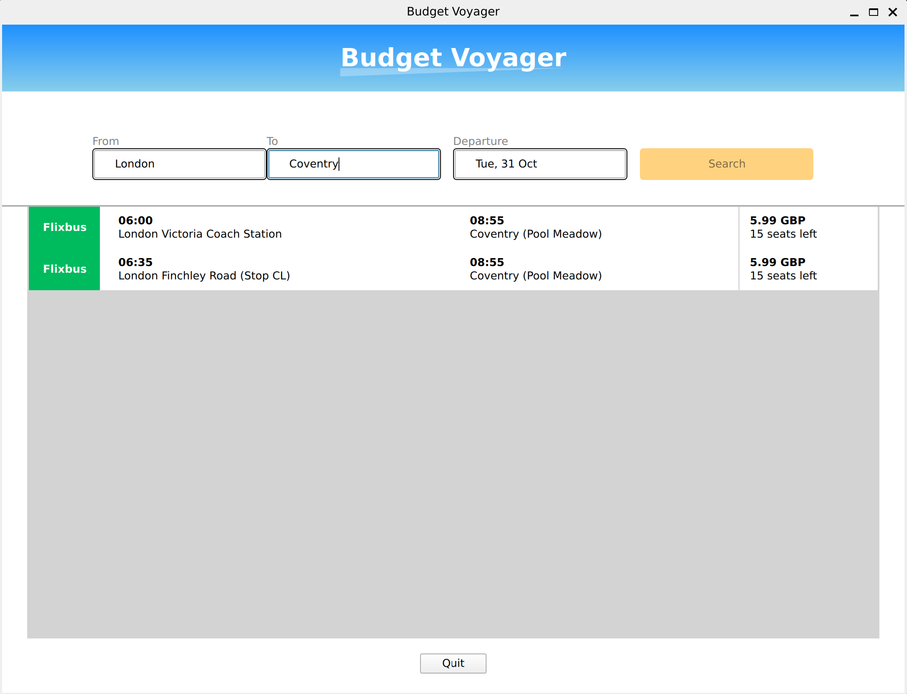

# FlixBus Route Finder App

## Description

This application currently allows users to gather information on Flixbus bus routes.

## How it Works

### 1. Data Population
The app starts by populating the `input/bus_stops.json` file by accessing various FlixBus API endpoints. The process begins with a manual collection of `legacy_id` for each city associated with FlixBus. The following steps are then performed:

- **City Details Fetching:**  
  Request is made to `https://global.api.flixbus.com/search/service/cities/details?locale=en_GB&from_city_id={legacy_id}` to gather the `name` and `UUID` of each city.

- **City Location Fetching:**  
  With the gathered city `name`, a request is made to `https://global.api.flixbus.com/search/autocomplete/cities?q={name}&lang=en&country=gb&flixbus_cities_only=false&stations=false` to fetch the `latitude` and `longitude` of each city.

After these steps, the `bus_stops.json` file is fully populated automatically.

### 2. User Interface
The GUI of the application provides dropdown boxes displaying all the available cities from the `bus_stops` file. Users can select their departure city, destination city, and preferred departure date.

### 3. Route Fetching
Upon making the selections, the GUI interacts with the backend to make a request to the FlixBus API and fetch available routes based on the provided parameters. The results are then displayed in the GUI.

## GUI Screenshots

### City Selection

### Route Data Display

# Future Developments
In addition to the `/input/bus_stops.json` file, the software is able to populate another file called `input/flixbus_tree.json`. This file is made by using the request `https://global.api.flixbus.com/cms/cities/uuid.lower()}/reachable?language=en-gl&country=GB&limit={limit}` and stores all reachable cities. Using the geographical data from `input/bus_stops`.json, this give a weighted graph. Using this with shortest path algorithms in cpp, I can find optimal routes without bombarding Flixbus's server with requests. The hope would be to later add other bus, train and plane companies for a mastery of UK public transport!

## License and Disclaimer

This software is provided "as is", without warranty of any kind, express or implied. The author(s) and maintainer(s) of this software are not affiliated with FlixBus or any of its subsidiaries or affiliates.

This application interacts with publicly accessible API endpoints provided by FlixBus. While the software is designed to use these APIs respectfully and responsibly, users are reminded that it is their responsibility to ensure compliance with FlixBus's terms of service, API usage policies, and any applicable laws and regulations.

To mitigate the impact on FlixBus's servers and to promote responsible API usage, every request made by this software to FlixBus's API includes a deliberate 2-second delay. Users should be aware that excessive or improper use of the API may lead to rate limiting or other restrictions imposed by FlixBus.

By using this software, users acknowledge and agree to these terms and conditions.

